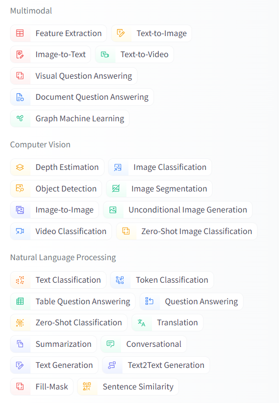

# HuggingFaceGuide

A guide to select HuggingFace models and a demo of the use of HuggingFace API. 

The first part is the guide. The second part is the [demo code](./HuggingFace_Pipeline_demo.ipynb), or [Colab](https://colab.research.google.com/gist/chinhang0104/e3ac7735c10a4fccd40d23c1daaa792e/huggingface-pipeline-demo.ipynb). 

## Guide

### Step 1: identify tasks

https://huggingface.co/models

We can choose task categories like Computer Vision, Natural Language Processing, and more in the left column. There are sub-task categories for each main task category. 

### Step 2: Choice the right models

After choosing the task we want, we can apply more filters to get the model we want. 

For example, we can choose language.

We can also filter licenses if we want to use the model commercially.

Moreover, we can use different kinds of sorting.

On the other hand, we can refer to the model leaderboard:
https://huggingface.co/open-llm-leaderboard

For example, Large Language Model Leaderboard:
https://huggingface.co/spaces/HuggingFaceH4/open_llm_leaderboard

There are options we can choose. Let’s look at them one by one.  

On the left side of the panel, we can choose what columns to be shown on the table. 

We can sort models by evaluation matrix:

On the right side of the panel, there are three options to filter models. 

The first filter is Model types: 

Filter model’s training process. 

Pretrained: Stock pre-trained model that can be used for inference directly.

Fine-tuned: Fine-tuned version from pre-trained models. They are designed specifically for certain tasks or improved versions of the stock model. Details can be checked on the fine-tuned model page.

Instruction-tuned: 

The models are fine-tuned using textual instructions.

To learn more: https://arxiv.org/abs/2109.01652

RL-tuned: 

The fine-tuning processes include human ranking the outputs of the language model.  

This enables engineers a way to control the output of models. 

A reward model is trained to imitate human scoring to reinforce learning. 

To learn more: https://huggingface.co/blog/rlhf

Precision: Support of lower bit precision will reduce the use of memory and space, and speed up models, but may lead to lower performance.  

Model size: A larger model is more capable in theory, but requires more memory, space, and computational resources.  

## Demo
Also, we can use the Hugging Face pipeline, which offers a simple API and is good for testing a blench of models. 

Here is a [demo notebook]](https://colab.research.google.com/gist/chinhang0104/66888f6bcde511acbbe2fc3000f7c5d9/huggingface-pipeline-demo.ipynb) using the HuggingFace pipeline API.
 
